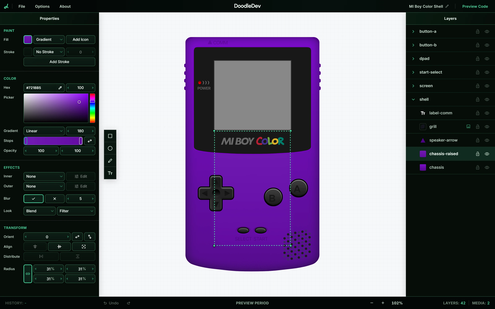
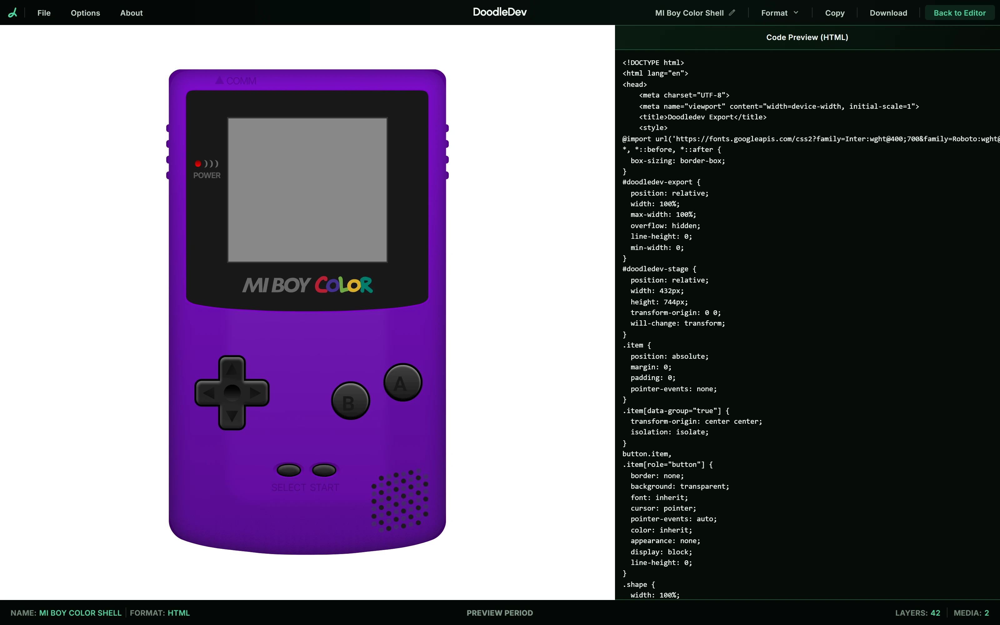

# DoodleDev

A visual design tool for the web. Draw on the canvas, refine the details, and export your design as a standalone page or Web Component.

**[Open the editor](https://doodledev.app/)**

Currently in public preview. Use a desktop browser; no account is needed.

## From canvas to the web

- **Draw your idea.** Combine shapes, paths, text and images on the canvas.
- **Refine the finish.** Adjust colours, gradients, shadows and effects as you work.
- **Keep your work organised.** Manage layers and groups, then save a local `.doodle` file to return to later.
- **Start with an example.** Explore the Mi Boy Color and MiPod Classic presets, or begin with a blank canvas.
- **Take your design with you.** Preview and download a standalone HTML page or Web Component, with no framework runtime required.

## Get started

1. Open [doodledev.app](https://doodledev.app/) on your desktop.
2. Choose a preset or a blank canvas and start designing.
3. Select **Preview Code** to review your design, choose an export format, and download it.

Exports contain the visual design. Interactive behaviour can be added separately when you use it in a site.

This repository contains public product information. The application source is not published here.

## Related

Explore the Mi Boy Color and MiPod Classic designs in use:

- [Mi Boy Color](https://builds.doodledev.app/?go=1#/miboy)
- [MiPod Classic](https://builds.doodledev.app/?go=1#/mipod)

Or visit [MitchIvin XP](https://mitchivin.com/), Mitch's interactive portfolio desktop.

## About

Built by [Mitch Ivin](https://mitchivin.com/).

Screenshots captured at 1920×1080.
