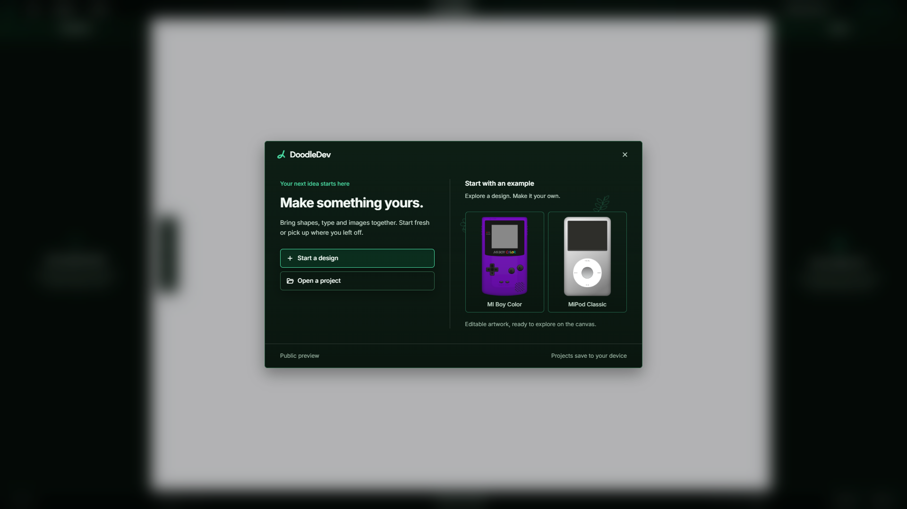

# DoodleDev

A visual design tool for the web. Draw on the canvas, refine the details, and export your design as a standalone page or Web Component.

**[Explore DoodleDev](https://doodledev.app/about/) · [Open Editor](https://doodledev.app/)**

Currently in public preview. Use a desktop browser; no account is needed.

## Features

- **Drawing tools.** Combine shapes, paths, text and images on the canvas.
- **Styling.** Adjust colours, gradients, shadows and effects as you work.
- **Layers and files.** Manage layers and groups, then save a local `.doodle` file to return to later.
- **Presets.** Explore the MI Boy Color and MiPod Classic presets, or begin with a blank canvas.
- **Export.** Preview and download a standalone HTML page or Web Component, with no framework runtime required.

## Learn more

- [Export types](https://doodledev.app/export/)
- [Builds](https://doodledev.app/builds/)
- [Getting started](https://doodledev.app/getting-started/)

## Get started

1. Open [doodledev.app](https://doodledev.app/) on your desktop.
2. Choose a preset or a blank canvas and start designing.
3. Select **Preview Code** to review your design, choose an export format, and download it.

Exports contain the visual design. Interactive behaviour can be added separately when you use it in a site.

This repository contains public product information. The application source is not published here.

## Related

Explore the MI Boy Color and MiPod Classic designs in use:

- [MI Boy Color](https://doodledev.app/builds/#miboy)
- [MiPod Classic](https://doodledev.app/builds/#mipod)

Or visit [MitchIvin XP](https://mitchivin.com/), Mitch's interactive portfolio desktop.

## About

Built by [Mitch Ivin](https://mitchivin.com/).

Screenshots captured at 1920 × 1080.
